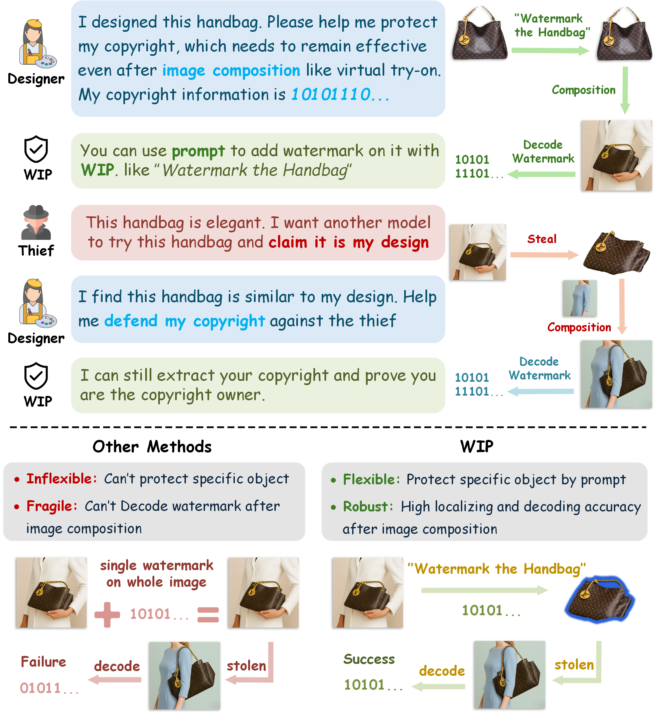
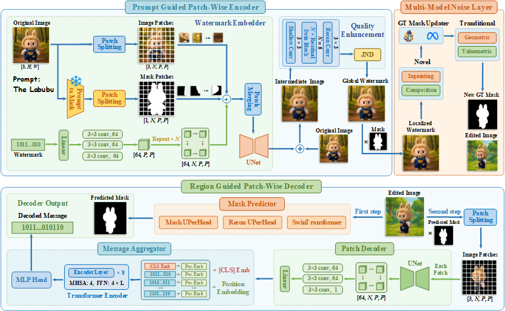
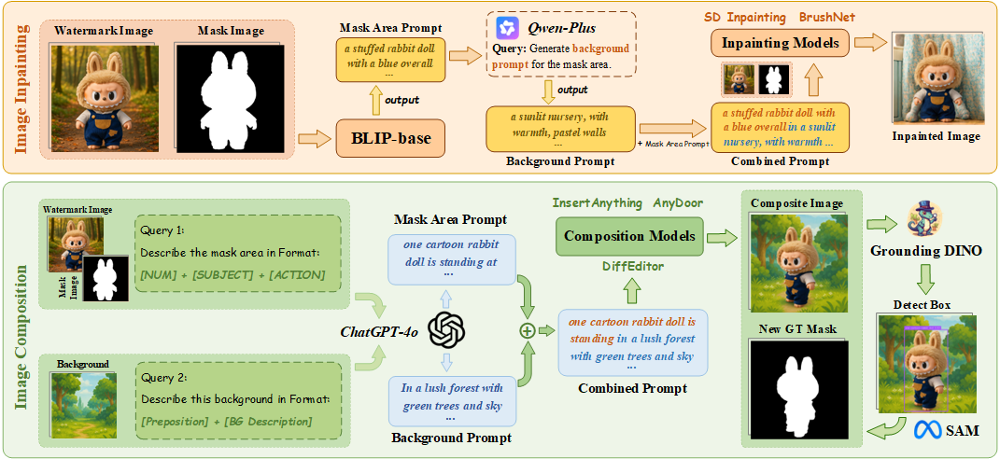
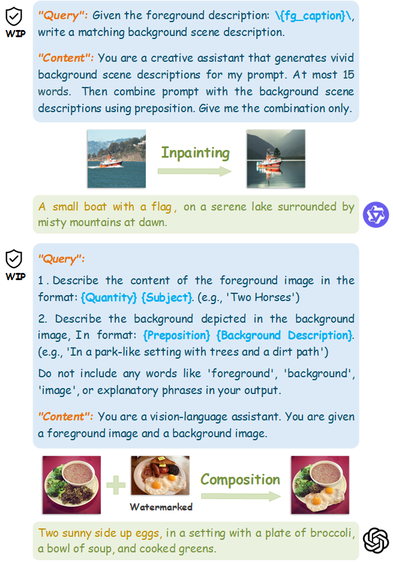
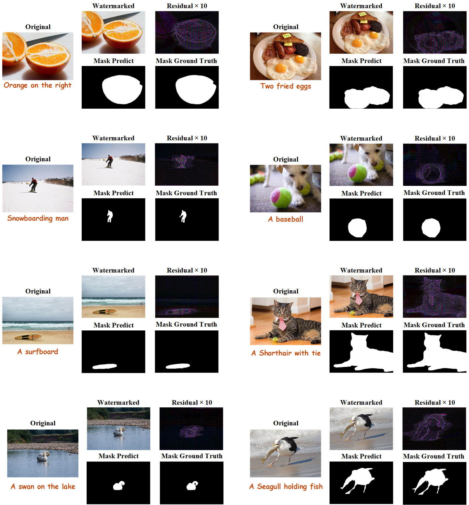

# WIP: Prompt-Guided, Robust Watermarking against Image Composition and Inpainting

> **Status:** Work in Progress 🚧  
> This repository contains ongoing research on "WIP: Prompt-Guided, Robust Watermarking against Image Composition and Inpainting".



## 📝 TODO

- ✅ Release testing codes
- ⬜ Release pre-trained models 
- ⬜ Release all training codes
- ⬜ Release the ten image composition models used in paper
- ⬜ Make a gradio demo on huggingface

---

## 📌 Overview


> **Figure 1.** Framework of our proposed framework.

---


> **Figure 2.** Overview of our collaborative multi-model noise layer.

---

## 🔧 Installation

### Create a conda environment
```bash
conda create -n WIP python=3.10 -y
conda activate WIP
```

### Install dependencies
```bash
pip install -r requirements.txt
```
---

## 🚩 Usage Guide

### Training

Complete training code will coming soon.

### Testing
```bash
python test.py
```
or you can find a step-by-step demo in the [Demo Notebook](demo.ipynb).

---

## 📋 Prompts Used in Noise Layer

We adopted a set of prompts to generate diverse edited images within the noise layer.  


---

## 🔍 Results

### Examples without attacks


